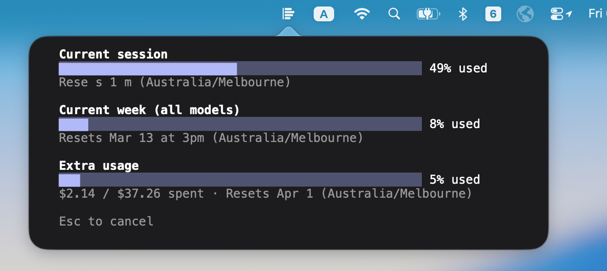

# CC Usage Bar

A minimal macOS menu bar app that shows your [Claude Code](https://claude.com/claude-code) usage at a glance.

## Why

Claude Code doesn't expose a persistent usage indicator. The only way to check is to open a session and type `/usage`. This app puts that information one click away in your menu bar — always up to date, always accurate.

## How it works

When you click the menu bar icon, CC Usage Bar opens a popover containing an embedded terminal. Behind the scenes it:

1. Spawns a real Claude Code session in a pseudo-terminal (PTY)
2. Sends the `/usage` command automatically
3. Captures the output and renders it with full ANSI color fidelity — exactly as it appears in your terminal
4. Terminates the session immediately after

There is no API scraping, no token parsing, no reverse engineering. The data comes straight from Claude Code itself, so it is always 100% accurate and reflects the latest state.

## Features

- **Minimal** — a single menu bar icon, one popover, no windows
- **Accurate** — reads directly from Claude Code's own `/usage` output
- **Safe** — no network calls, no credentials stored, no hacks; just runs `claude` the same way you would
- **Zero setup** — install, open, click the icon (requires Claude Code already configured on your machine)
- **Native** — built in Swift with SwiftUI, runs as a lightweight menu bar agent

## Requirements

- macOS 14 Sonoma or later
- [Claude Code](https://docs.anthropic.com/en/docs/claude-code) installed and logged in (`claude` must be on your PATH)

## Install

### Download (recommended)

1. Download the latest `CCUsageBar.zip` from the [Releases](../../releases) page
2. Unzip and move `CCUsageBar.app` to your `/Applications` folder

> **Note:** Since this app is not notarized, macOS Gatekeeper will block it on first launch.
> To open it, either:
> - Right-click the app → **Open** → **Open**
> - Or run in Terminal: `xattr -d com.apple.quarantine /Applications/CCUsageBar.app`

### Build from source

1. Clone the repository
2. Open `CCUsageBar/CCUsageBar.xcodeproj` in Xcode
3. Build and run (Cmd+R)

The app runs as a menu bar agent — there is no Dock icon. Look for the chart icon in your menu bar.

## Usage

- **Left-click** the menu bar icon to open the usage popover
- **Click anywhere outside** the popover to dismiss it
- **Right-click** the menu bar icon to quit

Each time you open the popover, it fetches fresh usage data.

## License

MIT

---

⭐ If this tool helps you avoid hitting Claude limits, consider giving it a star!
